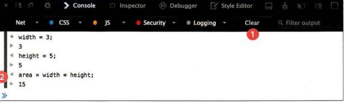

## Error Handling and Debugging
everybody when write java script code make mistakes but there are way to find the errors in the code.

### ERROR OBJECTS 
1. Error
is the error effect on the code work

2. SyntaxError
this error when we have error in spacific line like write something wrong 

3. ReferenceError 
when call the function wronge or not exist

4. TypeError
An unexpected data type that cannot be coerced 

5. RangeError
Numbers not in acceptable range

6. URLError
when write links wrong

## TYPING IN THE CONSOLE
we can show the result of the code in the consol just write `consol.log(....);`

