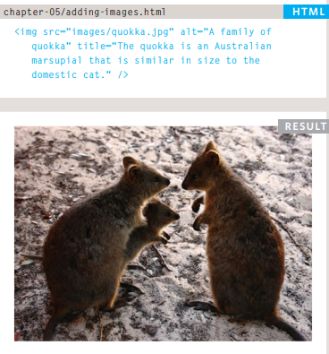
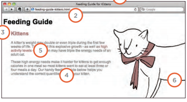

## Image
* To but image in tour web site you should use `
example:

And you can change the image size by using (height and width)

*To control image position like but it in the center use `img.align-center`* 
*To but image as background use 
`body {`
     `background-image: url("images/pattern.gif");}`

we can when but the backgroud image spacify if we want to repeat it or no and if we want the repeat horizantal or vertical
`repeat-x` horizantal 
`repeat-y` vertical
`no repeat` mean no repeat for image
`fixed`  stay in the same position on the page

## Practical Information

1. Page title
2. URL
3. Heading
4. Text
5. Link text
6. Image 

