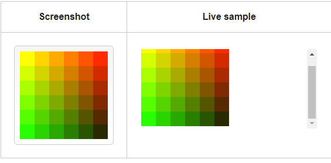
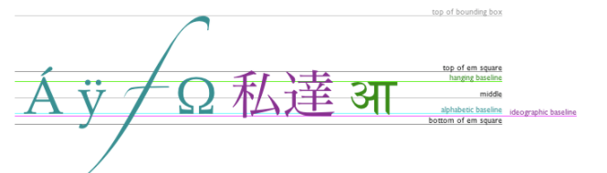

## Chart
the best way to  start with charts is with Chart.js, a JavaScript plugin that uses HTML5’s canvas element to draw the graph onto the page. 

1. we need to do is download Chart.js. Copy the Chart.min.js out of the unzipped folder and into the directory you’ll be working in.*
  ``
  we write it in the `<head></head>`  

2. we need to drow a line chart
`<canvas id="buyers" width="600" height="400"></canvas>`

3. to drawing a pie chart
`<canvas id="countries" width="600" height="400"></canvas>`

4. to drawing a bar chart
`<canvas id="income" width="600" height="400"></canvas>`

`<canvas>` element has only two attributes,(width and height)

##Drawing rectangles

1. fillRect(x, y, width, height) :Draws a filled rectangle.
2. strokeRect(x, y, width, height) :Draws a rectangular outline.
3. clearRect(x, y, width, height) :Clears the specified rectangular area, making it fully transparent.

## Colors
1. `fillStyle = color` :Sets the style used when filling shapes.
2. `strokeStyle = color` :Sets the style for shapes' outlines.

## Styling text
1. font = value : The default font is 10px sans-serif.
2. textAlign = value : like (center, left, right) the defult is start.
3. textAlign = value :top, hanging, middle, alphabetic, ideographic) the defult is alphabetic.
4. direction = value : ltr, rtl, inherit. The default is inherit.

