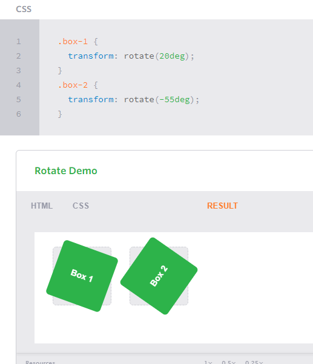
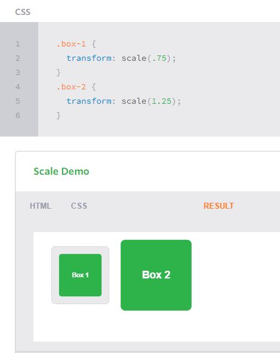
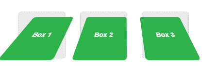
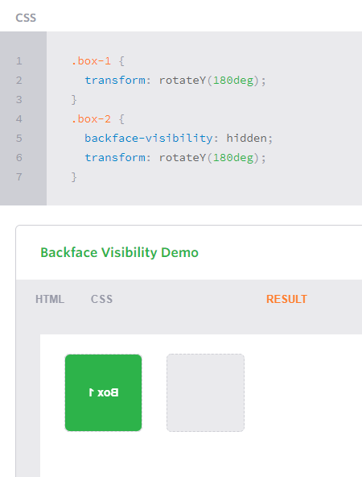

## Transforms
in this option you can control by the page like when make `div` you can display it as you like by `rotate` 
example:

### 2D scale:
 in this way you can transform the size
 the defult size os 1 but you can change it if it between 01 - .99 it well be smaller but if use it greater than 1 it will be larger.
  example:
  

we can combining between Transforms 
example:
`.box-1 {`
  `transform: rotate(25deg) scale(.75);`
`}`

### perspective
  `perspective: 200px;`
  

  ### 3D transforms
  #### 3D Rotate
  `.box-2 {`
  `transform: perspective(200px) scaleZ(.25) rotateX(45deg);`
`}`

### Backface Visibility
we can hiddin the box by this way

## Transitions & Animations
when you make for example square and want to change it color or shape by click on it you can use `:hover`
example:
`.box {`
 ` background: #2db34a;`
  `transition-property: background;`
  `transition-duration: 1s;`
  `transition-timing-function: linear;`
`}`
`.box:hover {`
 ` background: #ff7b29;`
`}`
in this example the square color is green but when put the mouse on it the color will change to orange
there are more examples on it like change the shape and color togather 