## Lists

* We can write lists in different ways:

1. Unordered List `<ul>`:
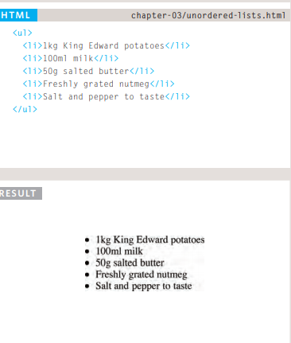

2. Ordered List `<ol>`:
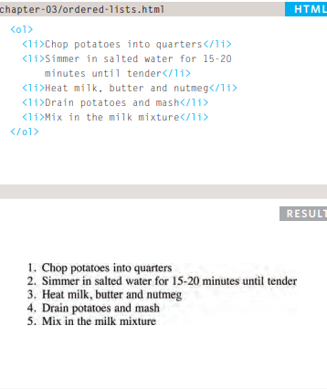

3. Definition Lists `<dl>`:
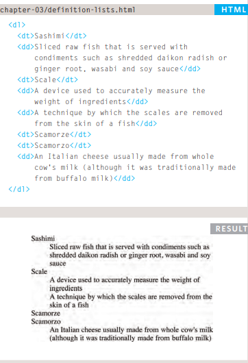

4. Nested Lists:
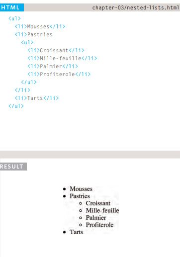

## Boxs

1. Box Dimensions: height,width:
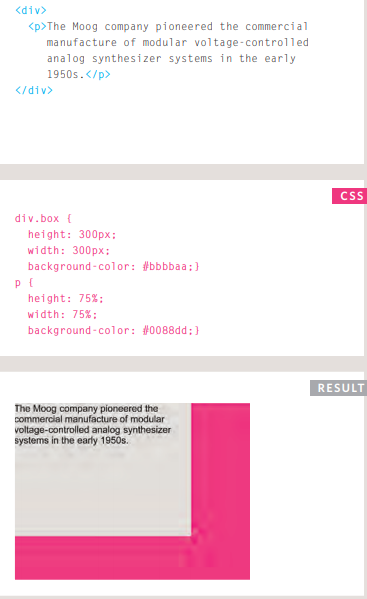

2. Border width:
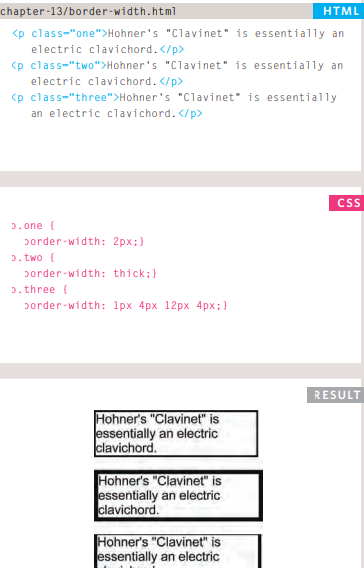
 
3. Border style:
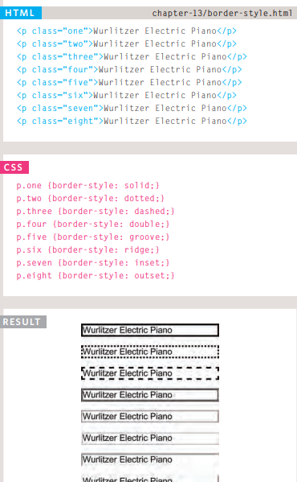

* Also we can use color to design it:
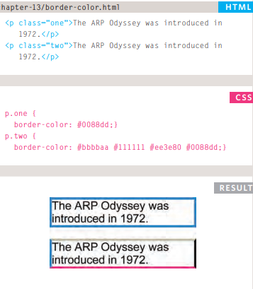

## Arrays
* You create an array and give it a name just like you would any other variable (using the var keyword followed by the name of the array). 

* You can create arrays by this way: 
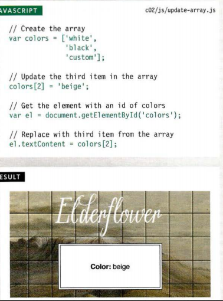

## IF...ELSE statment

* Here you can see that an if ... e 1 se statement allows you to provide two sets of code:
1. one set if the condition evaluates to true
2. another set if the condition is false
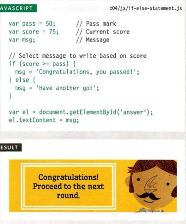

## USING SWITCH STATEMENTS 
* In this example, the purpose of the switch statement is to present the user with a different message depending on which level they are at. The message isstored in a variable called msg
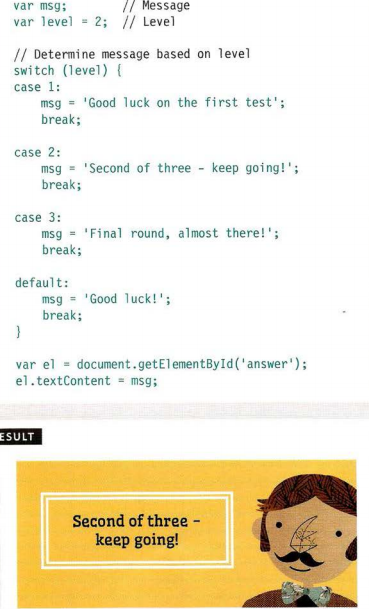

