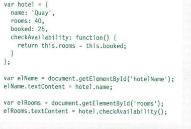
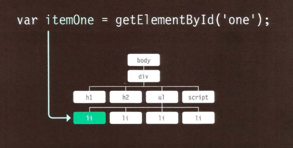

## WHAT IS AN OBJECT?
* Objects group together a set of variables and functions to create a model of a something you would recognize from the real world. In an object, variables and functions take on new names. 
example:
`var campus = {`
`name:ltuc,`
`};`

`campus` is an object 
`name` is a key
`ltuc` is a value

## Document object model
* The Document Object Model (DOM) specifies how browsers should create a model of an HTML page and how JavaScript can access and update the contents of a web page while it is in the browser window.
example:

`<!DOCTYPE html>`
`<html>`
`<body>`

`<h2>Finding HTML Elements by Tag Name</h2>`

`
Hello World!
`
`
This example demonstrates the <b>getElementsByTagName</b> method.
`

`

`

``

`</body>`
`</html>`

`

`here will be the result `The text in first paragraph (index 0) is: Hello World!`
becouse we use the `p` as array if we change array to 1 the result will be `The text in first paragraph (index 0) is: This example demonstrates the getElementsByTagName method.`

