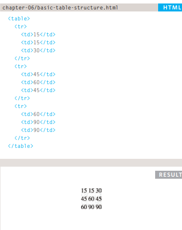

## Tables

### Basic Table Structure:
`<table>` this element to create new table that contan of colomns and rows
`<tr>` used to create new row
`<td>` used to fill the data in the rows
`<th>` used to make header in the table
example:

and we can make designs for it by CSS.

## Creating an object
for creating object we shoudld do this
`let sara ={`
    `location: 'irbid',`

`}`
sara is an object 
location is the key or properites 
irbid is the value

`var hotel = new Object();`
`hotel.name= 'Park';`
`hotel.rooms = 120;`
`hotel .booked = 77;`
`hotel .checkAvailability = function()`
`return this.rooms - this.booked;`
`} ;`
`var elName = document.getElementByid('hotelName');`
`elName.textContent = hotel . name;`
`var elRooms = document .getElementByid('rooms');`
`elRooms.textContent = hotel .checkAvailability(};` 
in this example we can by java script change the values like rooms
rooms =120 we lacked it of the books number 
for view the output we using 
`var elRooms = document .getElementByid('rooms');`
after that we calling the function
`elRooms.textContent = hotel .checkAvailability(};` 

`var width = 600;`
`var shape = {width: 300};`
`var showWidth-= function(){`
`document .write (this.width) ;`
`};`
`showWidth();`
here we used `this` this is reference to the its object

