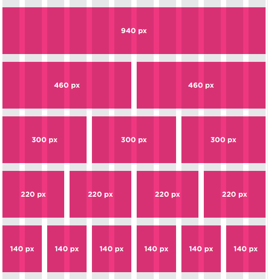

## Layout
* It is common to group a number of elements together inside a `
` For example, you might group together all of the elements that form the header of a site (such as the logo and the main navigation). The `
` element that contains this group of elements is then referred to as the containing element.

there are some of positions:
1. static: this appear the the element vertically .
2. relative: this make push down and right from the normal place.
3. absolute: it make to role as header.

we can make a lot of designs on `
` to make the page more order.
You can include multiple CSS files in one page.

sometimes we face some problems with the device size , there are some of devices have small screen and ather have big screen.

#### Fixed Width Layouts:
this give the fixed design , if the screen changed rhe design will be same.

#### Liquid Layouts:
it used if we increase or decrease the size of the browser.

#### Possible Layouts:
960 Pixel wide
12 Column Grid
Grids help create professional and flexible designs.

