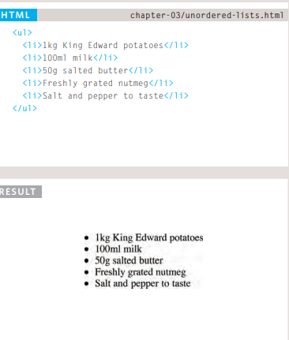
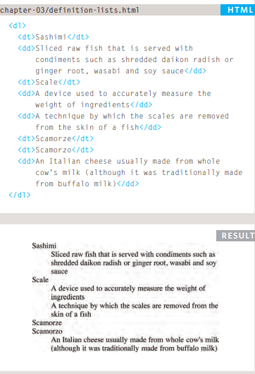

# Forms 

1. ADDING TEXT:
  *Text input*

 `<input type="text" name="username" size="15" maxlength="30" />`
here will see form named username .

  *Password input*
  `<input type="password" name="password" size="15" maxlength="30" />`
  this matching with user name but password allow the user when inter the password appear as dotes 
 
  *text area*
  `<textarea name="comments" cols="20" rows="4">Enter your comments...</textarea>`
  here you can make area to write any thing and you can control number of colomns .

2. Making Choices:
  *Radio buttons*
  `<input type="radio" name="genre" value="rock" checked="checked" /> Rock`
` <input type="radio" name="genre" value="pop" />Pop`
 `<input type="radio" name="genre" value="jazz" />Jazz`
this like circle
  *Checkboxes*
  `<input type="checkbox" name="service" value="itunes" checked="checked" /> iTunes`
 `<input type="checkbox" name="service" value="lastfm" /> Last.fm`
 `<input type="checkbox" name="service" value="spotify" /> Spotify`
 this matching with radio buttons but the differance is in checkbox you can select more than one item
 this like square

  *Drop-down boxes*
  `<select name="devices">`
 `<option value="ipod">iPod</option>`
 `<option value="radio">Radio</option>`
 `<option value="computer">Computer</option>`
 `</select>`
 this way you can select the items by drop down box

3. Submitting Forms:
   *Submit button*
   *Image buttons*
   *File upload*

###  Form Validation
we can make validation on any form we want 
`<label for="username">Username:</label> <input type="text" name="username"  required="required" /></title>`
required mean this should fill and if it not fill will show massage to alart you

## List
we can make lists in different designs when use `<ol>` and mak styling for it like `ol {list-style-type: lower-roman;}`
the numbers will appear in roman language.
we can change it by pictures also.

1. Unordered List `<ul>`:

2. Ordered List `<ol>`:

3. Definition Lists `<dl>`:

4. Nested Lists:

## Tables

### Basic Table Structure:
`<table>` this element to create new table that contan of colomns and rows
`<tr>` used to create new row
`<td>` used to fill the data in the rows
`<th>` used to make header in the table
example:

and we can make designs for it by CSS.